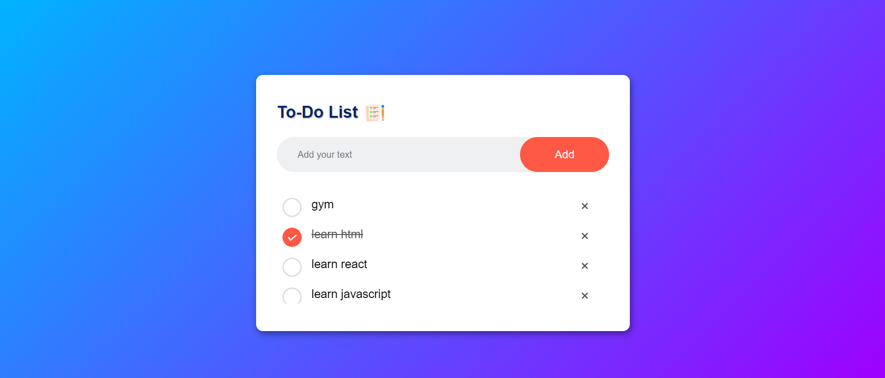
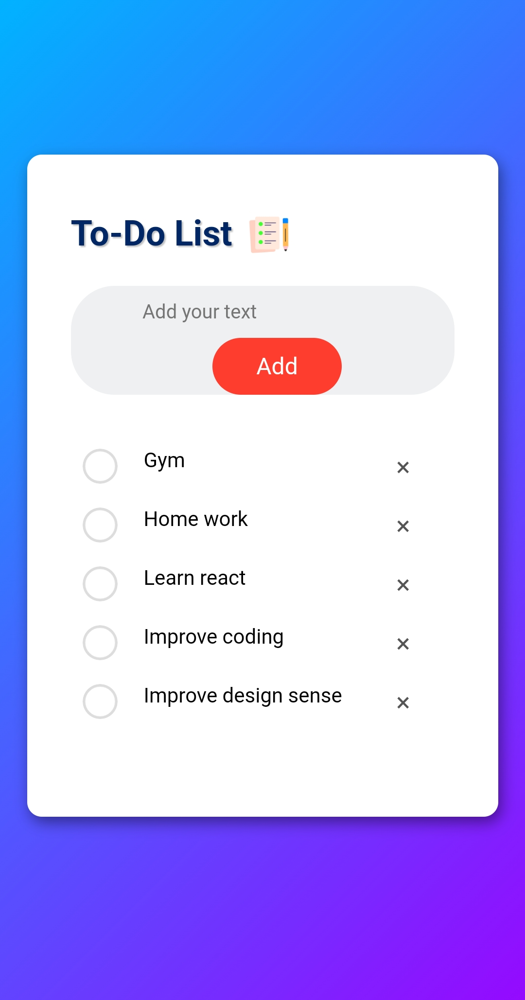

# 📝 To-Do List App

A simple, elegant, and fully responsive To-Do List application to manage your daily tasks effectively. The app allows users to add, mark, and remove tasks, offering a clean and intuitive interface with smooth animations and modern UI elements.

## 🚀 Features

- **Add Tasks:** Input tasks and add them to the list.
- **Mark as Completed:** Click on any task to mark it as completed with a strikethrough and checked icon.
- **Delete Tasks:** Remove tasks by clicking on the "X" button with smooth fading animation.
- **Local Storage Support:** All tasks are saved in the browser’s local storage, so your tasks persist even after refreshing the page.
- **Responsive Design:** Fully responsive, adjusts seamlessly to different screen sizes for optimal usability on mobile, tablet, and desktop.
- **Smooth Animations:** Hover and fade-in/out animations for better UX.
  
## 💻 Tech Stack

- **HTML5:** Structure and content.
- **CSS3:** Styling and layout.
- **JavaScript (ES6):** Functionality and task handling.
- **LocalStorage:** Store and retrieve tasks persistently.

## 📸 Screenshots

### Desktop View:


### Mobile View:
![Mobile View]

## 🛠 Installation and Setup Instructions

1. **Clone the repository:**

    ```bash
    git clone (https://github.com/Abhaysprasobh/To-Do-List-web-application.git)
    ```

2. **Navigate into the project directory:**

    ```bash
    cd todo-app
    ```

3. **Open `index.html` in your browser:**

    You can directly open the `index.html` file in your preferred browser by double-clicking it, or you can use a live server (like the VSCode Live Server extension).

## 📂 Project Structure

```bash
├── index.html          # Main HTML file
├── styles.css          # Custom CSS styles
├── scripts.js          # JavaScript logic for adding/removing tasks
├── images/             # Folder containing images used in the app
│   ├── icon.png        # App icon
│   ├── unchecked.png   # Unchecked circle icon
│   └── checked.png     # Checked circle icon
└── README.md           # Project documentation (this file)
```

## 🎨 UI Design

The UI has been designed with simplicity and functionality in mind. The app uses a **light theme** with a **gradient background**, rounded input fields, and large, touch-friendly buttons for mobile users. Smooth animations provide a modern touch to task interactions.

## 🌐 Live Demo

You can check out the live demo of this project here:

[Live Demo](https://abhaysprasobh.github.io/To-Do-List-web-application/)

## ✨ Future Enhancements

- **Filter Tasks:** Add functionality to filter tasks (e.g., all tasks, completed, or pending).
- **Edit Tasks:** Allow users to edit tasks once they are added.
- **Categories/Tags:** Introduce task categorization with labels or tags.
- **Dark Mode:** Add an option to switch between light and dark themes.

## 🤝 Contributing

Contributions, issues, and feature requests are welcome! Feel free to check the [issues page](https://github.com/your-username/todo-app/issues) if you'd like to contribute.

## 📝 License

This project is licensed under the MIT License - see the [LICENSE](LICENSE) file for details.

## 📧 Contact

Feel free to reach out if you have any questions or suggestions!

- **Author:** Abhay S Prasobh
- **GitHub:** [your-github-profile](https://github.com/Abhaysprasobh/To-Do-List-web-application.git)
